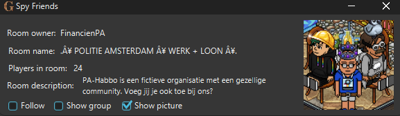

# SpyFriends
Find out where your friends are without leaving your room

## How to use this extension
Follow, show group and show picture are on by default. When you turn follow off you are not able to follow a friend. When you turn show group off you can't see the room group changing when checking where your friends are. You also need to wait a couple seconds before following another person, because habbo is blocking spam follow requests. If you don't wait the room results will not update. 

## Example

